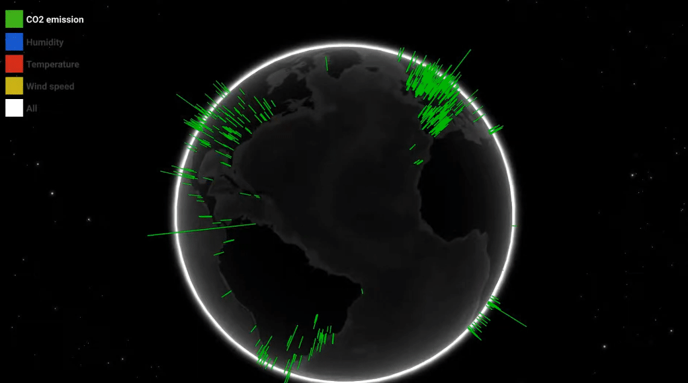
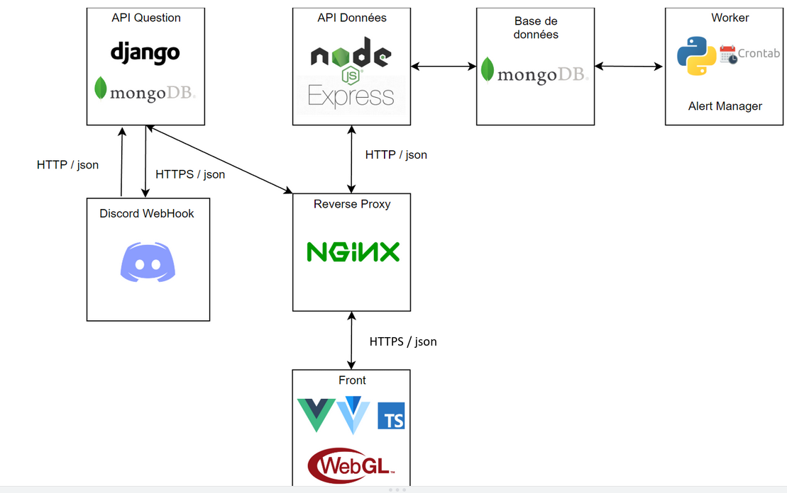

# PlanetViz 🌍

PlanetViz is a website that helps you visualize Earth's data over time in 3D

It uses [OpenWeatherMap](https://openweathermap.org/api) as a source of data. It make call every day to get multiple weather infos then it make average on months and years.

# Trailer 📹

A video trailer can be found [here](https://www.youtube.com/watch?v=ubznlPuQukg)

# Screenshots 🖼

# Architecture 📚

## Project status ★
The website is no longer hosted